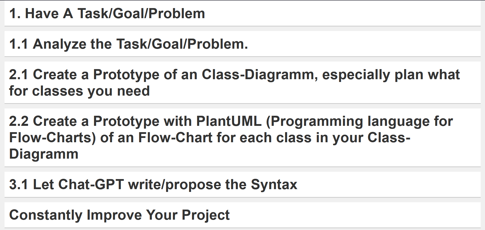

# Basics of Programming - Personal Approach

This repository contains a webpage where I have documented the basics of my personal programming approach. It serves as a structured guide, summarizing key concepts and principles I find essential in software development.

## Preview

## Features
- Clearly structured explanations of fundamental programming concepts.
- A personal take on best practices and methodologies.
- Simple and easy-to-follow content designed for both beginners and experienced developers.
